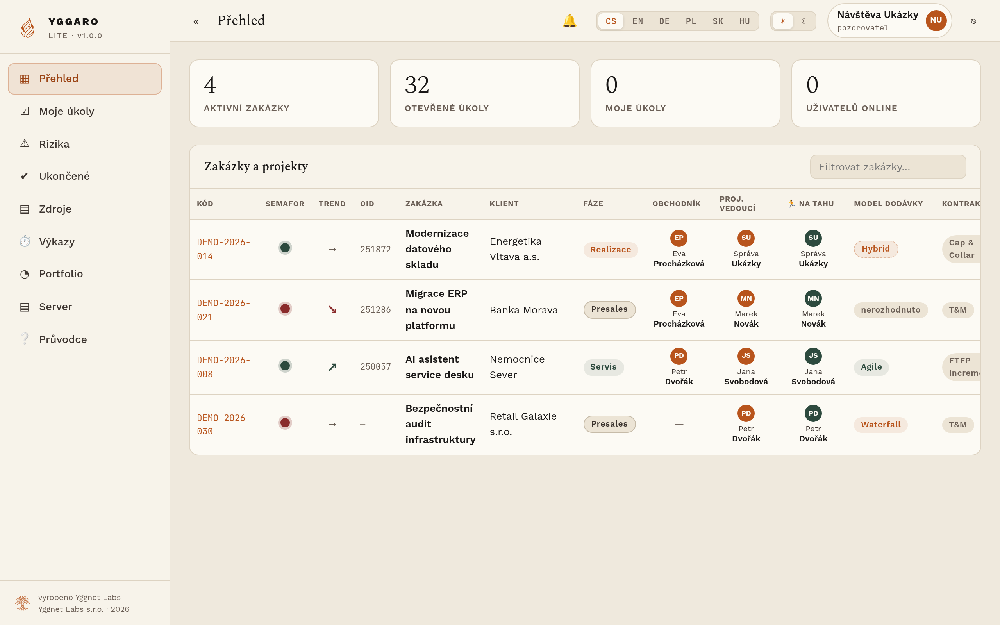
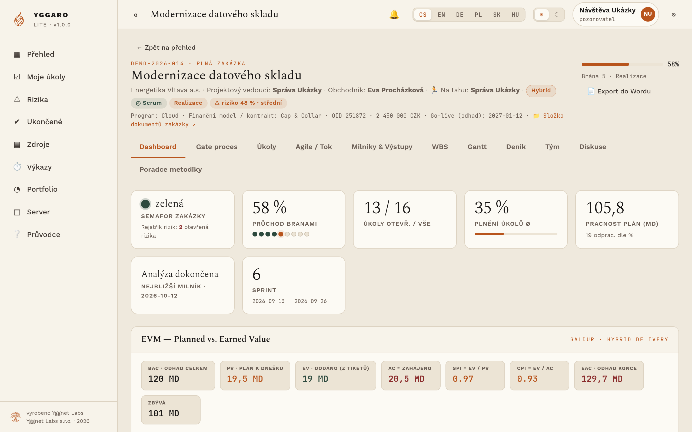
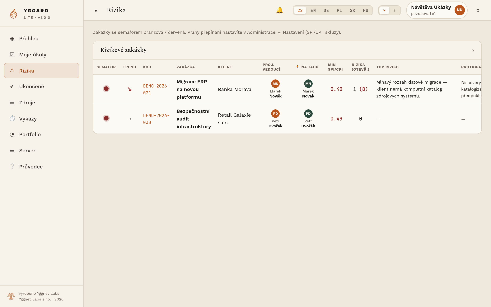
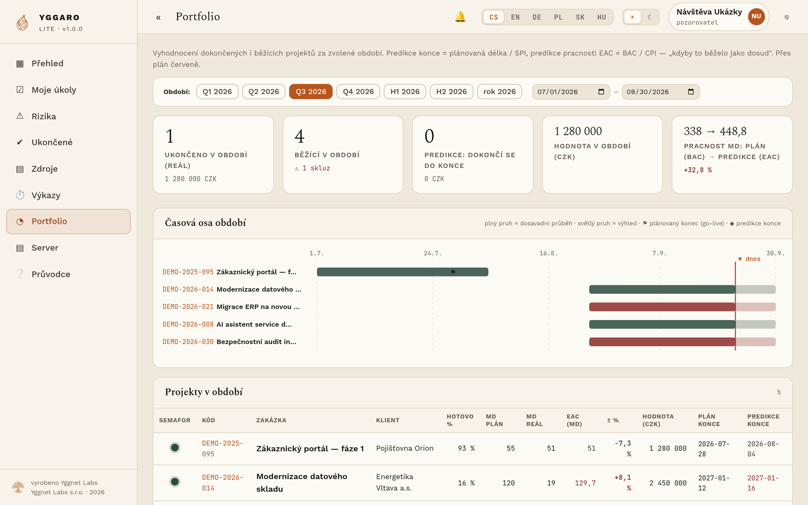

# Yggaro Lite

[English](README.md) · [Čeština](README.cs.md)

Yggaro Lite drží práci pro zákazníky, rozhodnutí, rizika a výstupy na jednom místě. Malý tým tak vidí, co postupuje, co stojí a kdo má rozhodnout dál.

Tento repozitář obsahuje **serverovou edici**. Jedna instance slouží jedné organizaci, má vlastní databázi a běží na vlastním stroji. Můžete ji provozovat sami nebo využít naši službu na [yggarolite.cz](https://yggarolite.cz).

*Vyzkoušejte si to bez instalace: [ukazka.yggarolite.cz](https://ukazka.yggarolite.cz) — ukázka jen ke čtení, s vymyšlenými daty. Přihlášení `ukazka@yggarolite.cz` / `UkazkaYggaro2026`.*

> **Rozsah produktu:** Vydaný produkt je **serverová binárka** na stránce [Releases](https://github.com/Yggnet-Labs/yggaro-lite/releases). Zdrojový kód aplikace v tomhle repozitáři není. Mesh (peer-to-peer edice pro desktop/LAN) a Lite AI (AI uvnitř aplikace) jsou jiné, odložené produkty a součástí tohohle stažení nejsou. U žádného neslibujeme termín.

## Proč ho týmy používají

- práce je uspořádaná kolem projektů, milníků, bran, rizik a převzatých výstupů;
- rozhodnutí a změny zůstávají dohledatelné místo toho, aby zmizely v chatu;
- každá organizace má oddělenou instanci a může svá data exportovat;
- zákazník může připojit vlastního AI klienta přes hlídané MCP; Yggaro Lite sám data aplikace žádnému modelu neposílá.

## Jak to vypadá

| | |
|---|---|
|  |  |
| **Detail zakázky** — milníky, brány a co na kom čeká | **Rizika** — obodovaná, s vlastníkem, u práce, kterou ohrožují |
|  |  |
| **Portfolio** — všechny zakázky na jedné obrazovce | Světlý i tmavý motiv, šest jazyků rozhraní |

Snímky jsou z veřejné ukázky, data jsou vymyšlená.

## Self-host stručně

Podporovaný cíl je Ubuntu 24.04 na `linux-amd64`, veřejná doména a porty 80/443. Stáhněte vydání ze stránky [Releases](https://github.com/Yggnet-Labs/yggaro-lite/releases). Soubor serveru se jmenuje `yggaro-server-linux-amd64`. Kontrolní součet právě toho souboru, právo ke spuštění a start jsou v [českém instalačním návodu](docs/install.cs.md). Tahle stránka ty příkazy neopakuje. Nenasazujte náhodnou větev ani automatický zdrojový archiv GitHubu. Ten archiv není zdroj aplikace.

## Dokumentace

**Rozjet** — [Instalace](docs/install.cs.md) · [Konfigurace](docs/configuration.md) · [Architektura](docs/architecture.md)

**Provozovat** — [Provoz](docs/operations.md) · [Záloha a obnova](docs/backup-restore.md) · [Aktualizace](docs/upgrade.md) · [Když něco nejde](docs/troubleshooting.cs.md)

**Důvěřovat** — [Bezpečnostní model](docs/security.cs.md) · [Data a soukromí](docs/data-and-privacy.cs.md) · [Ověření vydání](docs/release-verification.md) · [Hlášení zranitelností](SECURITY.md)

**Připojit vlastní AI** — [MCP](docs/mcp.cs.md) · [Oprávnění](docs/mcp-permissions.cs.md) · [Nástroje a jejich meze](docs/mcp-tools.cs.md) · [Roadmapa](docs/mcp-roadmap.cs.md)

**Ostatní** — [FAQ](docs/faq.cs.md) · [Podpora](SUPPORT.md) · [Verzování](VERSIONING.md) · [Pravidla chování](CODE_OF_CONDUCT.md)

## Licence

Tenhle repozitář zveřejňuje dokumentaci a serverovou binárku, ne zdrojový kód aplikace. Binárka se nabízí pod licencí přiloženou k vydání (FSL-1.1-ALv2). Ta licence není OSI open source. Nabízet produkt jako konkurenční komerční službu třetím stranám se nesmí. Tahle stránka neslibuje, že si přečtete nebo upravíte zdroj aplikace. Ve stažení není. Čtěte [LICENSE](LICENSE) a [NOTICE](NOTICE). Kde se shrnutí a licence rozejdou, platí licence.

## Vývoj

Zdrojový kód aplikace v tomhle repozitáři zveřejněný není. Jsou tu dokumentace a vydání. Issues a dotazy jsou vítané, ale pull request nemá co přeložit. Není to slib, že zdroj později zveřejníme.

Jak budeme příspěvky přijímat, popisuje [CONTRIBUTING.md](CONTRIBUTING.md). Zranitelnosti hlaste soukromě podle [SECURITY.md](SECURITY.md).
