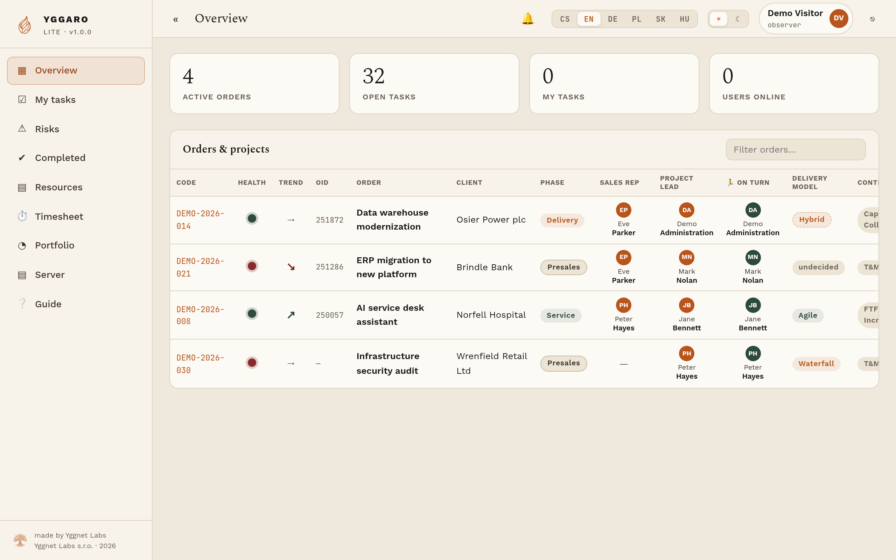
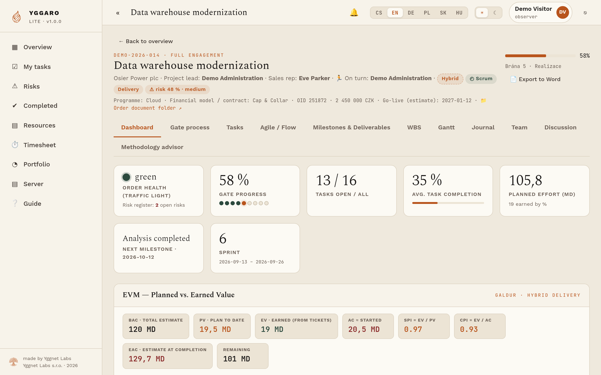
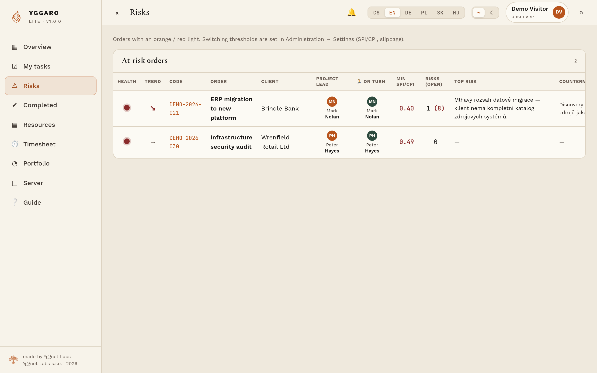
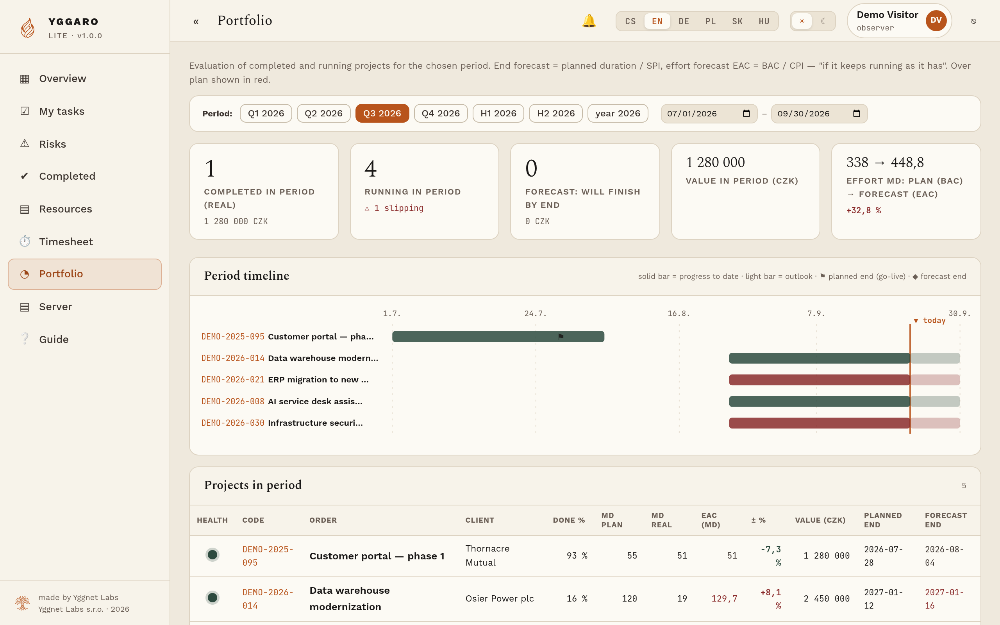
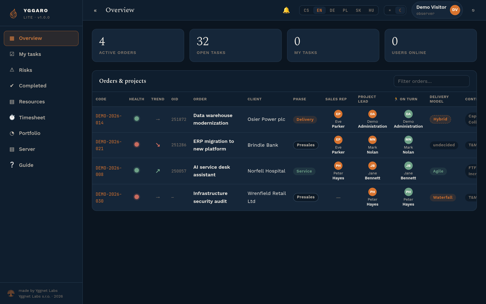

# Yggaro Lite

[English](README.md) · [Čeština](README.cs.md)

Yggaro Lite keeps client work, decisions, risks and deliverables in one place so a small team can see what is moving, what is blocked and who must decide next.

This repository contains the **server edition**. One instance serves one organisation, with its own database on its own machine. Run it yourself or use the hosted service at [yggarolite.cz](https://yggarolite.cz).



*Try it without installing anything: [ukazka-en.yggarolite.cz](https://ukazka-en.yggarolite.cz) — a read-only demo with invented data. Sign in as `demo@yggarolite.cz` / `UkazkaYggaro2026`.*

> **Product scope:** Yggaro Lite Server is approaching its first production release, `1.0.0`. Mesh (peer-to-peer desktop/LAN edition) and Lite AI (AI inside the application) are separate, deferred products. No release date is promised for either.

## Why teams use it

- work is organised around projects, milestones, gates, risks and accepted deliverables;
- decisions and changes remain attributable instead of disappearing in chat;
- each organisation has an isolated instance and can export its data;
- a customer's own AI client can connect through the guarded MCP interface — **entirely optional and off by default**; Yggaro Lite runs fully without any AI and does not send application data to a model by itself.

## What it looks like

| | |
|---|---|
|  |  |
| **Order detail** — milestones, gates and what is waiting on whom | **Risks** — scored, owned, and attached to the work they threaten |
|  |  |
| **Portfolio** — every engagement on one screen | Light and dark, six interface languages |

Screenshots are from the public demo, with invented data.

## Self-host in brief

The supported first-release target is Ubuntu 24.04 on `linux-amd64`, with a public domain and ports 80/443. Download the release binary and `SHA256SUMS`, verify it, then follow [the installation guide](docs/install.md).

```bash
sha256sum -c SHA256SUMS
./yggaro-server -version
```

Do not deploy from a random branch or from GitHub's autogenerated source archive. Use the checksummed release materials once `1.0.0` is published.

## Documentation

**Run it** — [Install](docs/install.md) · [Configuration](docs/configuration.md) · [Architecture](docs/architecture.md)

**Keep it running** — [Operations](docs/operations.md) · [Back up and restore](docs/backup-restore.md) · [Upgrade](docs/upgrade.md) · [Troubleshooting](docs/troubleshooting.md)

**Trust it** — [Security model](docs/security.md) · [Data and privacy](docs/data-and-privacy.md) · [Verifying a release](docs/release-verification.md) · [Report a vulnerability](SECURITY.md)

**Connect your AI** — [MCP](docs/mcp.md) · [Permissions](docs/mcp-permissions.md) · [Tools and their limits](docs/mcp-tools.md) · [Roadmap](docs/mcp-roadmap.md)

**Everything else** — [FAQ](docs/faq.md) · [Support](SUPPORT.md) · [Versioning](VERSIONING.md) · [Code of Conduct](CODE_OF_CONDUCT.md)

## Licence

Yggaro Lite is **source-available, not OSI open source**, under FSL-1.1-ALv2. Internal use, study and modification are permitted; offering a competing commercial service to third parties is not. Read [LICENSE](LICENSE) and [NOTICE](NOTICE). Third-party components and their full licence texts are in [THIRD-PARTY-NOTICES.md](THIRD-PARTY-NOTICES.md); the binary can print them with `-third-party-notices`. The licence text, not this summary, governs.

## Development

The source tree is not published in this repository yet — it carries the documentation and the releases. Until it is, issues and questions are welcome, but a pull request has nothing to build against.

See [CONTRIBUTING.md](CONTRIBUTING.md) for how we will take contributions, and report vulnerabilities privately as described in [SECURITY.md](SECURITY.md).
